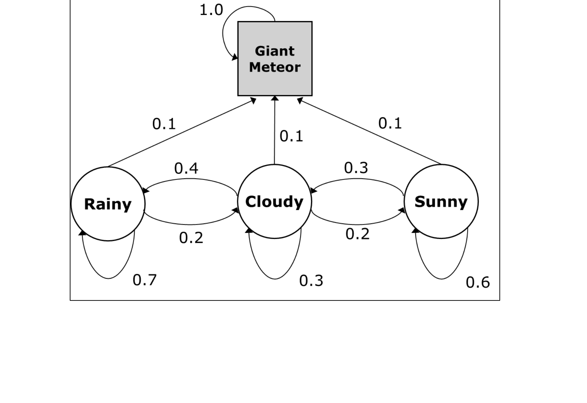

# COMP 372 - Artificial Intelligence (In-Class Coding Demos)

## Markov Chain Demo (2026.04.14)

An in-class exercise modeling weather on **Planet Terror™**, a parallel-universe Earth where each day falls into one of four states: **Rainy (R)**, **Cloudy (C)**, **Sunny (S)**, or **Giant Meteor (G)**.

### State-Transition Graph

### Transition Matrix

The transition probabilities below define $p(S_{t+1} = s' \mid S_t = s)$, with rows and columns in alphabetical order:

|              | Cloudy | Giant Meteor | Rainy | Sunny |
|--------------|:------:|:------------:|:-----:|:-----:|
| **Cloudy**       | 0.3    | 0.1          | 0.4   | 0.2   |
| **Giant Meteor** | 0.0    | 1.0          | 0.0   | 0.0   |
| **Rainy**        | 0.2    | 0.1          | 0.7   | 0.0   |
| **Sunny**        | 0.3    | 0.1          | 0.0   | 0.6   |

Giant Meteor is an **absorbing state** — once reached, the system stays there with probability 1.

### Exercises

| Question | Problem | Answer |
|----------|---------|--------|
| 1.1 | Set of Markov states | {Cloudy, Giant Meteor, Rainy, Sunny} |
| 1.2 | Write the transition matrix | See table above |
| 2.1 | P(tomorrow = Cloudy \| today = Sunny) | **0.30** |
| 2.2 | P(day after tomorrow = Sunny \| today = Rainy) | **0.04** |
| 2.3 | P(Giant Meteor within 5 days \| today = Sunny) | **≈ 0.41** |

All questions are answered in [`markov_chains.ipynb`](markov_chains.ipynb) using NumPy vector–matrix multiplication ($\mathbf{s}_{t+k} = \mathbf{s}_t \cdot T^k$). The notebook also includes a plot of P(Giant Meteor) over 30 time steps starting from a uniform distribution over the non-meteor states.
